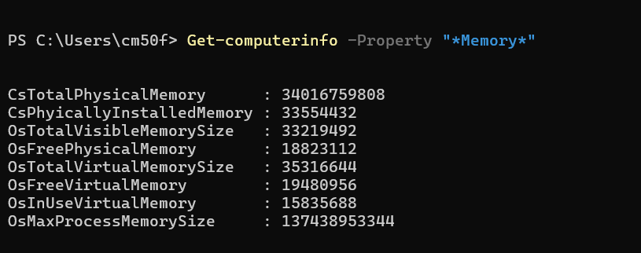
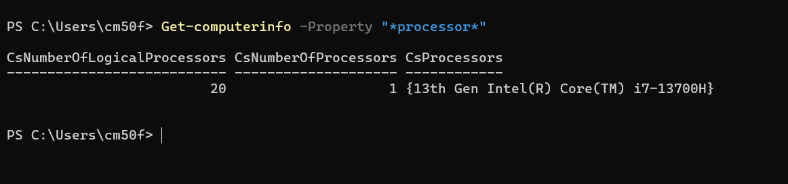

# Week1

## Task1
Created GitHub account, created learning repository 

---
## Task 2: Computer Information

### Memory Values:
* **Total Physical Memory:** 34,016,759,808 Bytes (~31.68 GiB / 34.02 GB)
* **Physically Installed Memory:** 33,554,432 KB (~32 GB)
* **Total Visible Memory Size:** 33,219,492 KB (~31.68 GB)
* **Free Physical Memory:** 18,823,112 KB (~17.95 GB)
---

#### Processor Values:
* **Processor Model:** 13th Gen Intel(R) Core(TM) i7-13700H
* **Number of Processors:** 1
* **Logical Processors:** 20
### Disk Information

#### Disk Values:
* **Drive C: Total Size:** 1,021,826,564,096 Bytes (~951.65 GB)
* **Drive C: Free Space:** 811,921,473,536 Bytes (~756.16 GB)

---

## Task 3: Operating Systems and Kernels

* **OS Family Tree:** Looked at how modern systems evolved from Unix and DOS.
* **Linux Kernel Diagram:** Shows how user apps communicate directly with hardware.
* **Interactive Kernel Map:** Explored layers for memory, drivers, and process scheduling.
* **Kernel Source Code:** Checked out real C files in the official repo.
* **Kernel Guide:** Read about OS X OS and core macOS design.
