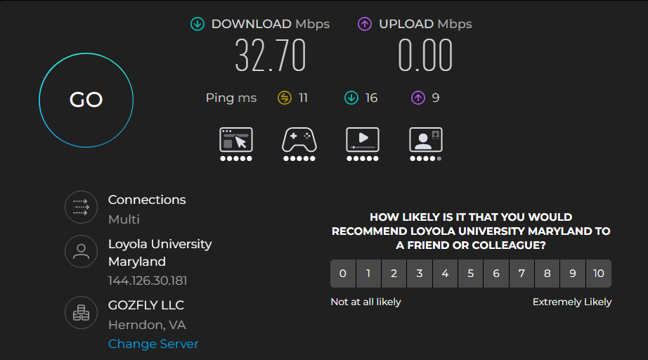
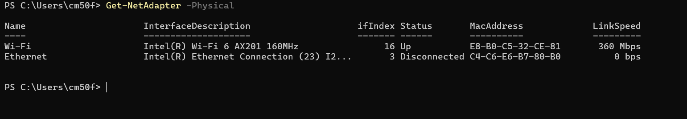

# Week 2

## Task 1: Speedtest

### Results:
* **Download Speed:** 32.70 Mbps
* **Upload Speed:** 0.00 Mbps
* **Ping:** 11 ms (Idle), 16 ms (Download), 9 ms (Upload)
* **ISP:** Loyola University Maryland
* **Server:** GOZFLY LLC (Herndon, VA)

### Factors Affecting Network Throughput:
* **Network Congestion:** Heavy traffic from other campus users sharing the bandwidth.
* **Connection Medium:** Signal loss and interference on Wi-Fi compared to Ethernet.
* **ISP Bandwidth Limits:** Speed caps and traffic management set by the network provider.

---

## Task 2: Global Network Infrastructure

* **Submarine Cable Map:** Explored physical undersea fiber cables connecting continents.
* **APNIC Resource Explorer:** Looked at how IPv4 and IPv6 addresses are allocated by region.
* **AARNet International Network:** Looked at cross-ocean network links used for research.
* **Hurricane Electric 3D Map:** Saw a 3D globe showing global data centers and undersea connection lines.

---

## Task 3: View a MAC Address with PowerShell

Ran PowerShell commands to display local MAC addresses:

### Recorded Physical MAC Addresses:
* **Wi-Fi Adapter:** `E8-B0-C5-32-CE-81` (Intel Wi-Fi 6 AX201, 360 Mbps)
* **Ethernet Adapter:** `C4-C6-E6-B7-80-B0` (Disconnected)
