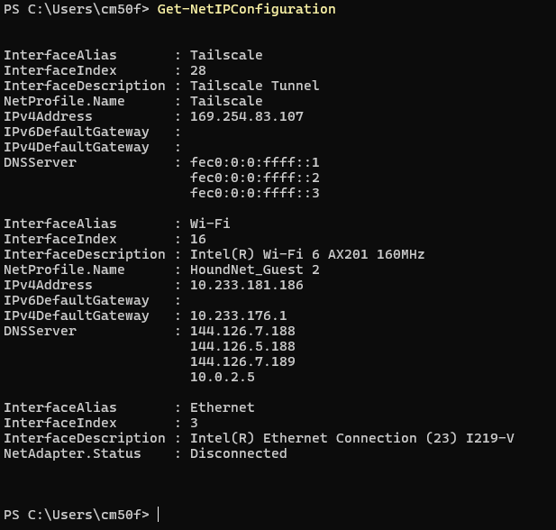
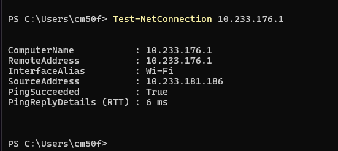

# Week 2

## Task 1: Speedtest

### Results:
* **Download Speed:** 32.70 Mbps
* **Upload Speed:** 0.00 Mbps
* **Ping:** 11 ms (Idle), 16 ms (Download), 9 ms (Upload)
* **ISP:** Loyola University Maryland
* **Server:** GOZFLY LLC (Herndon, VA)

### Factors Affecting Network Throughput:
* **Network Congestion:** Heavy traffic from other campus users sharing the bandwidth.
* **Connection Medium:** Signal loss and interference on Wi-Fi compared to Ethernet.
* **ISP Bandwidth Limits:** Speed caps and traffic management set by the network provider.

---

## Task 2: Global Network Infrastructure

* **Submarine Cable Map:** Explored physical undersea fiber cables connecting continents.
* **APNIC Resource Explorer:** Looked at how IPv4 and IPv6 addresses are allocated by region.
* **AARNet International Network:** Looked at cross-ocean network links used for research.
* **Hurricane Electric 3D Map:** Saw a 3D globe showing global data centers and undersea connection lines.

---

## Task 3: View a MAC Address with PowerShell

Ran PowerShell commands to display local MAC addresses:

### Recorded Physical MAC Addresses:
* **Wi-Fi Adapter:** `E8-B0-C5-32-CE-81` (Intel Wi-Fi 6 AX201, 360 Mbps)
* **Ethernet Adapter:** `C4-C6-E6-B7-80-B0` (Disconnected)

---
## Task 4: IP and Local Router Information

### Network Configuration Details (Wi-Fi):
* **Interface Alias:** Wi-Fi (Intel Wi-Fi 6 AX201 160MHz)
* **Interface Index:** 16
* **IPv4 Address:** `10.233.181.186`
* **Default Gateway (Router):** `10.233.176.1`
* **DNS Servers:** `144.126.7.188`, `144.126.5.188`, `144.126.7.189`, `10.0.2.5`

## Task 5: Test Connectivity (Ping)

### Ping Results:
* **Command:** `Test-NetConnection 10.233.176.1`
* **Target Router:** `10.233.176.1`
* **Ping Succeeded:** True
* **Round Trip Time (RTT):** 6 ms

### Delay Factors:
* **Wi-Fi Latency:** Wireless signals have higher delay than ethernet.
* **Local Congestion:** Shared campus access points create processing delays.
* **Router Load:** High traffic on the default gateway increases reply time.
