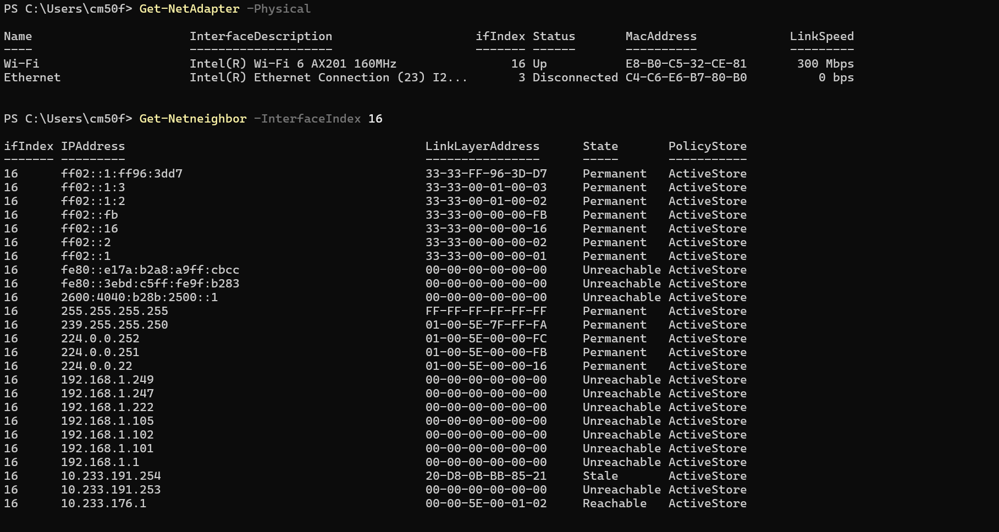

# Tutorial 3

## Task 1: View ARP Table

### Purpose of ARP Packets:
* The Address Resolution Protocol (ARP) translates known Layer 3 IP addresses into local Layer 2 MAC addresses so devices on the same physical network can transmit data frames to each other.

### Discovered Devices in the ARP Table:
* **Default Gateway (Router):**
  * **IP Address:** `10.233.176.1`
  * **MAC Address:** `00-00-5E-00-01-02`
  * **State:** Reachable
  * **Reason:** This is the local default gateway router for the Wi-Fi connection that forwards traffic out to the internet.
* **Campus Subnet Device:**
  * **IP Address:** `10.233.191.254`
  * **MAC Address:** `20-D8-0B-BB-85-21`
  * **State:** Stale
  * **Reason:** This is another host or network device on the same local campus network that recently exchanged packets with my computer.
