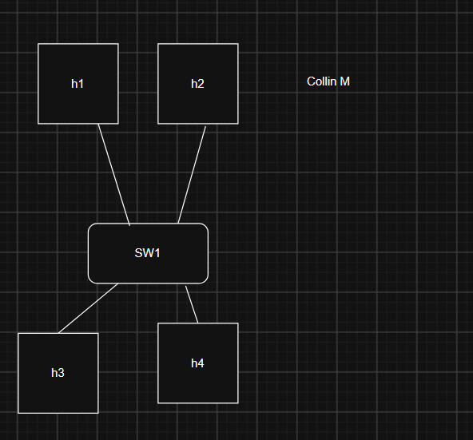
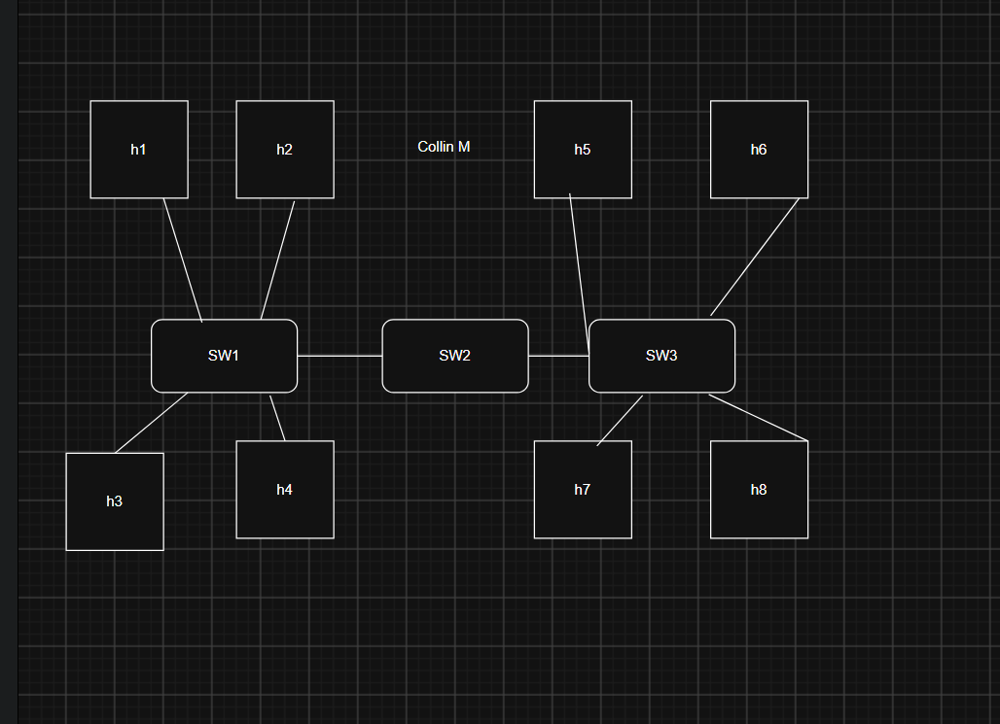

# Tutorial 3

## Task 1: View ARP Table

### Purpose of ARP Packets:
* The Address Resolution Protocol (ARP) translates known Layer 3 IP addresses into local Layer 2 MAC addresses so devices on the same physical network can transmit data frames to each other.

### Discovered Devices in the ARP Table:
* **Default Gateway (Router):**
  * **IP Address:** `10.233.176.1`
  * **MAC Address:** `00-00-5E-00-01-02`
  * **State:** Reachable
  * **Reason:** This is the local default gateway router for the Wi-Fi connection that forwards traffic out to the internet.
* **Campus Subnet Device:**
  * **IP Address:** `10.233.191.254`
  * **MAC Address:** `20-D8-0B-BB-85-21`
  * **State:** Stale
  * **Reason:** This is another host or network device on the same local campus network that recently exchanged packets with my computer.

---

## Task 2: Draw Network Diagrams

### a) Single Switch LAN (4 PCs, 1 Switch)

* **Configuration:** A switched local area network consisting of one central switch (`SW1`) directly connected to four hosts (`h1`, `h2`, `h3`, `h4`).

### b) Switched LAN Star Topology (8 PCs, 3 Switches)

* **Configuration:** Two access switches (`SW1` and `SW3`) connect four hosts each (`h1`–`h4` and `h5`–`h8`), and both access switches connect into a third central switch (`SW2`) forming a star topology.

---

## Task 4: Learning Reflection

### Tools Used in Weeks 1–3:
* **PowerShell:** Command-line tool used to run administrative networking commands.
* **Get-NetAdapter & Get-NetIPConfiguration:** Commands used to find physical MAC addresses, IP addresses, and default gateway details.
* **Test-NetConnection & ping:** Tools used to verify network connectivity and measure round-trip delay.
* **Resolve-DnsName:** Command used to query DNS servers and map domain names to IP addresses.
* **Get-NetNeighbor:** Command used to view and monitor the local ARP table.
* **diagrams.net:** Web tool used to design and draw switched LAN network topologies.

### Useful Tool Outside of Class:
* **ping / Test-NetConnection:**
  * This is an essential troubleshooting tool for home and workplace networks. If the internet goes down, pinging the local default gateway instantly confirms whether the problem is with the local Wi-Fi router or upstream with the internet service provider.
