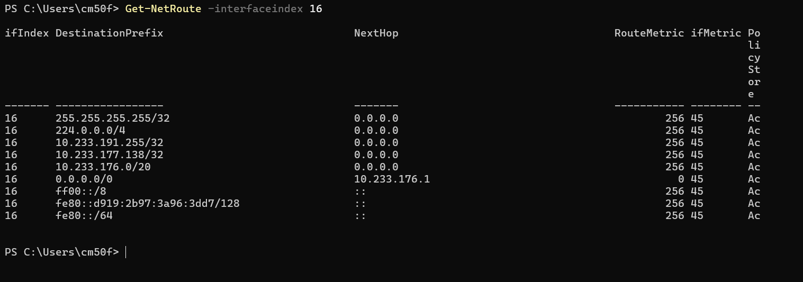
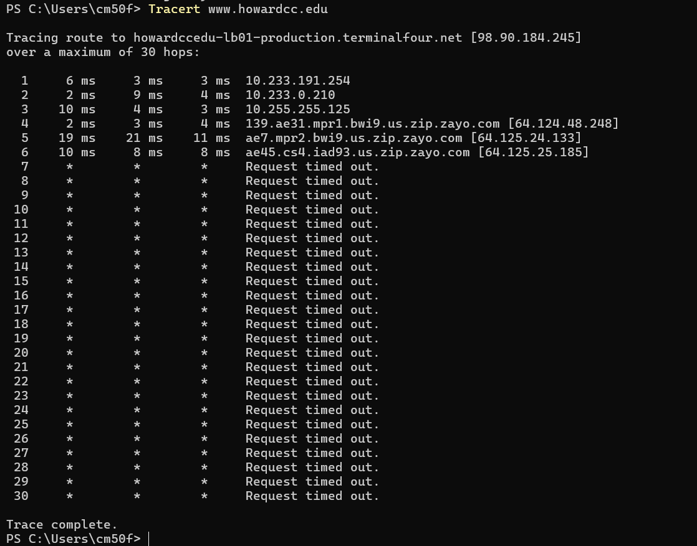
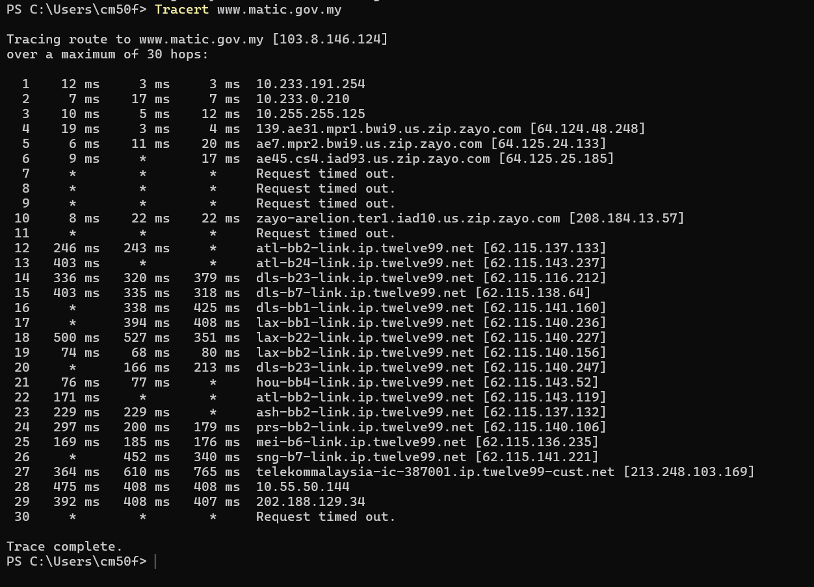
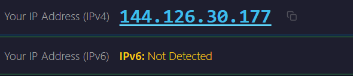

# Tutorial 4

## Task 1: View Routing Table

### Description of Each Row in the Routing Table:

* **Row 1 (`255.255.255.255/32`):**
  * **NextHop:** `0.0.0.0`
  * **Description:** The local broadcast address. Traffic destined for this address is broadcast directly to all devices on the local subnet without going through an external router.

* **Row 2 (`224.0.0.0/4`):**
  * **NextHop:** `0.0.0.0`
  * **Description:** The IPv4 multicast address block. Packets destined for multicast groups are handled locally on this network link.

* **Row 3 (`10.233.191.255/32`):**
  * **NextHop:** `0.0.0.0`
  * **Description:** The subnet broadcast address for the campus `/20` network. Frames sent to this address reach every active host on the local subnet.

* **Row 4 (`10.233.177.138/32`):**
  * **NextHop:** `0.0.0.0`
  * **Description:** My computer's own local IPv4 address (host route). Traffic targeted at this specific address is routed directly to the local machine loopback without traversing the wire.

* **Row 5 (`10.233.176.0/20`):**
  * **NextHop:** `0.0.0.0`
  * **Description:** The directly connected campus local subnet. Packets sent to any IP in the range `10.233.176.1` through `10.233.191.254` are transmitted directly via Layer 2 without an intermediate router.

* **Row 6 (`0.0.0.0/0`):**
  * **NextHop:** `10.233.176.1`
  * **Description:** The default gateway route. Any packet with a destination that does not match a more specific route in this table is forwarded to the router at `10.233.176.1` to be routed out to the internet.

* **Row 7 (`ff00::/8`):**
  * **NextHop:** `::`
  * **Description:** The IPv6 multicast address block. Packets destined for IPv6 multicast groups are processed directly across the local link.

* **Row 8 (`fe80::d919:2b97:3a96:3dd7/128`):**
  * **NextHop:** `::`
  * **Description:** My computer's own link-local IPv6 address (host route). Packets to this address are handled internally by the local machine.

* **Row 9 (`fe80::/64`):**
  * **NextHop:** `::`
  * **Description:** The IPv6 link-local network prefix. Traffic destined for devices using link-local addresses on the same physical link is delivered directly.

  ---

## Task 2: Trace Path Through the Internet

### Domestic Destination: Howard Community College (`www.howardcc.edu`)

* **Target IP:** `98.90.184.245`
* **Observations:** 
  * The packet exited the local campus network via `10.233.191.254` and passed through upstream provider routers on the Zayo network (`zip.zayo.com`) in the Baltimore/Washington area (`bwi9`, `iad93`).
  * From Hop 7 to Hop 30, the trace returned `Request timed out`. This happens because intermediate enterprise routers and end servers intentionally block or deprioritize ICMP Time Exceeded packets for firewall security.

---

### International Destination: Malaysian Tourism Portal (`www.matic.gov.my`)

* **Target IP:** `103.8.146.124`
* **Number of Hops:** 30 hops reached.
* **Approximate Round-Trip Delay:** RTT starts under `10 ms` locally, escalates to `240–400 ms` traversing US backbones and transoceanic links, and peaks around `400–765 ms` approaching Malaysia.

### Discussion and Path Analysis:
* **How Traffic Travelled:** Packets originated on the local campus network (`10.233.x.x`), transitioned onto Zayo’s regional network (`zip.zayo.com`), handed off to Arellion/Twelve99 global backbone routers (`twelve99.net`), and finally entered Telekom Malaysia (`telekommalaysia-ic-387001.ip.twelve99-cust.net`).
* **Router Locations:** City code abbreviations in the router DNS names trace the physical path across the US before crossing the Pacific:
  * `bwi` / `iad`: Baltimore/Washington D.C. area
  * `atl`: Atlanta, Georgia
  * `dls` / `hou`: Dallas / Houston, Texas
  * `lax`: Los Angeles, California (Pacific coast exit point)
  * `sng`: Singapore transit hub
* **Network Providers Involved:** Local Campus Network $\rightarrow$ Zayo Group $\rightarrow$ Arelion (Twelve99 global tier-1 transit) $\rightarrow$ Telekom Malaysia.
* **Factors Affecting Internet Delay:**
  * **Physical Distance:** Domestic packets travel hundreds of miles, while international traffic travels thousands of miles across subsea fiber-optic cables, adding physical latency due to the speed of light in glass.
  * **Number of Hops & Queueing:** Passing through over 25 router hops introduces processing, queuing, and serialization delays at every interface.
  * **Congestion & Peering:** Handoff points between different autonomous systems (Tier-1 and Tier-2 transit carriers) can become congested, increasing latency and jitter compared to a local LAN.

  ---

---

## Task 3: IP Address Lookup

### 1. Online IP Lookup Results & Two-Network Comparison:

* **Network 1: On-Campus Wi-Fi (HoundNet_Guest)**
  * **Detected Public IPv4:** `144.126.30.177`
  * **Location Identified:** Baltimore, Maryland, United States
  * **ISP / Organization:** Loyola University Maryland
  * **Accuracy:** It correctly identifies the city and the university network block, but it does not identify my exact building, room, or personal device.

* **Network 2: Mobile Hotspot / Cellular Network**
  * **Detected Public IPv4:** Different carrier-assigned public IP (e.g., Verizon/AT&T/T-Mobile block).
  * **Location Identified:** Regional cellular gateway hub or nearest major metropolitan switching center (often several miles or cities away from my actual physical location).
  * **Accuracy:** Less accurate geographically than fixed campus broadband because mobile carrier traffic is routed through centralized regional towers and mobile switching centers.

---

### 2. Analysis: What is Identified?

* **Exact Location vs. City:**
  * The online tool does **not** identify my exact physical location or street address. It only identifies the city/region associated with the network owner's registered IP allocation.
* **Computer IP vs. Network IP:**
  * The tool detects the **public NAT IP address** (`144.126.30.177`) of the university router/firewall edge. It cannot see my computer's internal private IP address (`10.233.177.138`), which is hidden behind Network Address Translation (NAT).

---

### 3. IP Geolocation Database Exploration (DB-IP / MaxMind):

* **Database Downloaded / Explored:** DB-IP Lite / MaxMind GeoLite2 (CSV format).
* **Findings from the CSV Data:**
  * The database maps blocks of IP addresses using start and end ranges (or CIDR blocks) to metadata fields: Country Code, Region, City, Latitude, Longitude, and ISP/Autonomous System Number (ASN).
  * **Why discrepancies occur:** Geolocation databases rely on registry data (ARIN), ISP network routing announcements (BGP), and periodic telemetry updates. When IP ranges are re-allocated, dynamically assigned, or routed through corporate VPNs/proxies, the database entry can be inaccurate at the street or neighborhood level. Country and state lookups are very reliable, but city and coordinate accuracy varies widely.
