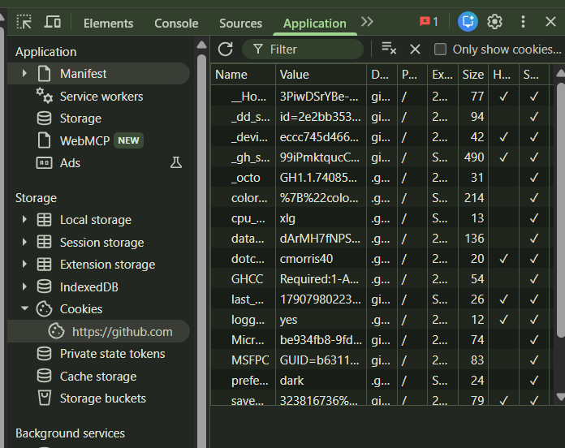
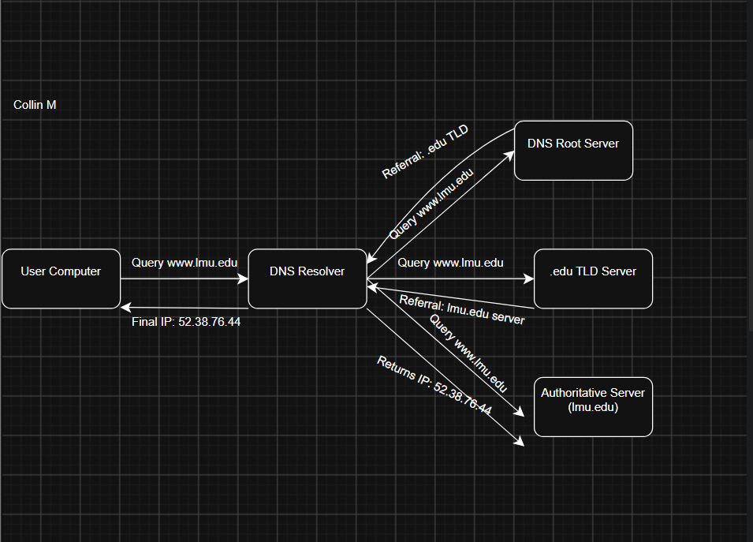

# Tutorial 5

## Task 1: View Your Cookies

### Types of Information Stored by Cookies:
* **User Identity & State:** The `dotcom_user` cookie stores my GitHub username (`cmorris40`) to maintain an active profile state, while `logged_in: yes` indicates whether the session is authenticated.
* **Interface Preferences:** The `color_mode` and `preferred_color_mode` cookies store UI settings (such as dark mode preferences) so the site renders correctly across page loads.
* **Session & Security Tokens:** The `_gh_sess` and `_Host-` cookies store cryptographically signed session tokens. They have the `HttpOnly` and `Secure` attributes enabled to prevent client-side JavaScript access and defend against cross-site scripting (XSS).
* **Analytics & Performance Tracking:** Cookies such as `_octo` and `_dd_s` track site performance metrics, client analytics, and navigation logs across GitHub services.

---

## Task 2: Root Servers and DNS Resolution

### 1. Role of the DNS Root Server:
* The DNS Root Servers represent the apex of the hierarchical Domain Name System (DNS).
* When resolving an unknown domain name such as `www.lmu.edu`, the recursive resolver queries a root server first.
* The root server does not store the final website IP address; instead, it parses the Top-Level Domain (TLD) extension (`.edu`) and responds with a referral containing the IP addresses of the authoritative `.edu` TLD nameservers.

---

### 2. Step-by-Step DNS Lookup Process for `www.lmu.edu`:

1. **Client Request:** The user enters `www.lmu.edu` into a web browser. The computer checks its local DNS cache; if the record is missing, it sends a recursive DNS query to the configured local recursive DNS resolver (such as campus DNS or ISP).
2. **Querying the Root:** The recursive resolver queries one of the 13 root server IP clusters (e.g., `a.root-servers.net`) for `www.lmu.edu`.
3. **Root Server Referral:** The root server identifies the `.edu` label and returns a referral pointing to the `.edu` TLD name servers.
4. **Querying the TLD Server:** The recursive resolver queries an `.edu` TLD nameserver for `www.lmu.edu`.
5. **TLD Server Referral:** The `.edu` TLD server returns a referral containing the authoritative nameservers responsible for the `lmu.edu` zone.
6. **Querying the Authoritative Server:** The recursive resolver issues an A-record query directly to the authoritative nameserver for `lmu.edu`.
7. **Authoritative Response:** The authoritative nameserver inspects its zone file and returns the final destination IP address (`52.38.76.44`).
8. **Final Delivery & Connection:** The recursive resolver caches the record locally and delivers the IP address to the user's computer. The browser then initiates an HTTP/HTTPS TCP handshake with `52.38.76.44`.
