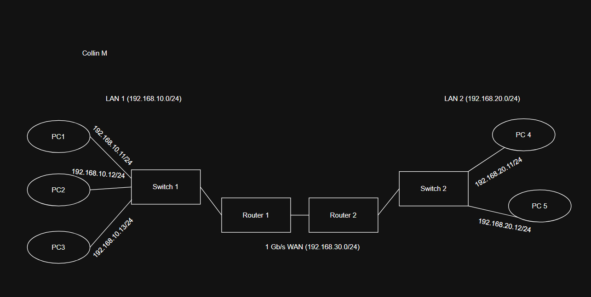

# Tutorial 5

## Task 1: View Your Cookies

### Types of Information Stored by Cookies:
* **User Identity & State:** The `dotcom_user` cookie stores my GitHub username (`cmorris40`) to maintain an active profile state, while `logged_in: yes` indicates whether the session is authenticated.
* **Interface Preferences:** The `color_mode` and `preferred_color_mode` cookies store UI settings (such as dark mode preferences) so the site renders correctly across page loads.
* **Session & Security Tokens:** The `_gh_sess` and `_Host-` cookies store cryptographically signed session tokens. They have the `HttpOnly` and `Secure` attributes enabled to prevent client-side JavaScript access and defend against cross-site scripting (XSS).
* **Analytics & Performance Tracking:** Cookies such as `_octo` and `_dd_s` track site performance metrics, client analytics, and navigation logs across GitHub services.

---

## Task 2: Root Servers and DNS Resolution

### 1. Role of the DNS Root Server:
* The DNS Root Servers represent the apex of the hierarchical Domain Name System (DNS).
* When resolving an unknown domain name such as `www.lmu.edu`, the recursive resolver queries a root server first.
* The root server does not store the final website IP address; instead, it parses the Top-Level Domain (TLD) extension (`.edu`) and responds with a referral containing the IP addresses of the authoritative `.edu` TLD nameservers.

---

### 2. Step-by-Step DNS Lookup Process for `www.lmu.edu`:

1. **Client Request:** The user enters `www.lmu.edu` into a web browser. The computer checks its local DNS cache; if the record is missing, it sends a recursive DNS query to the configured local recursive DNS resolver (such as campus DNS or ISP).
2. **Querying the Root:** The recursive resolver queries one of the 13 root server IP clusters (e.g., `a.root-servers.net`) for `www.lmu.edu`.
3. **Root Server Referral:** The root server identifies the `.edu` label and returns a referral pointing to the `.edu` TLD name servers.
4. **Querying the TLD Server:** The recursive resolver queries an `.edu` TLD nameserver for `www.lmu.edu`.
5. **TLD Server Referral:** The `.edu` TLD server returns a referral containing the authoritative nameservers responsible for the `lmu.edu` zone.
6. **Querying the Authoritative Server:** The recursive resolver issues an A-record query directly to the authoritative nameserver for `lmu.edu`.
7. **Authoritative Response:** The authoritative nameserver inspects its zone file and returns the final destination IP address (`52.38.76.44`).
8. **Final Delivery & Connection:** The recursive resolver caches the record locally and delivers the IP address to the user's computer. The browser then initiates an HTTP/HTTPS TCP handshake with `52.38.76.44`.

---

## Task 3: IP Network Design

### Network Specification & IP Subnet Allocation
To fulfill the requirements using `/24` subnets (mask `255.255.255.0`):
* **LAN 1 (3 PCs + Switch 1 + Router 1):** `192.168.10.0/24`
* **LAN 2 (2 PCs + Switch 2 + Router 2):** `192.168.20.0/24`
* **WAN Link (Router 1 to Router 2 Point-to-Point):** `192.168.30.0/24`

---

### a) Device & Interface IP Addressing Table

| Device | Interface | IP Address | Subnet Mask | Default Gateway | Connected To |
| :--- | :--- | :--- | :--- | :--- | :--- |
| **PC 1** | eth0 | `192.168.10.11` | `255.255.255.0` | `192.168.10.1` | Switch 1 (Port 1) |
| **PC 2** | eth0 | `192.168.10.12` | `255.255.255.0` | `192.168.10.1` | Switch 1 (Port 2) |
| **PC 3** | eth0 | `192.168.10.13` | `255.255.255.0` | `192.168.10.1` | Switch 1 (Port 3) |
| **Switch 1** | Management | Unmanaged / Layer 2 | N/A | N/A | Connects PC1–3 & Router 1 |
| **Router 1** | eth0 (LAN) | `192.168.10.1` | `255.255.255.0` | N/A | Switch 1 (Port 8) |
| **Router 1** | eth1 (WAN) | `192.168.30.1` | `255.255.255.0` | N/A | Router 2 (eth1) |
| **Router 2** | eth1 (WAN) | `192.168.30.2` | `255.255.255.0` | N/A | Router 1 (eth1) |
| **Router 2** | eth0 (LAN) | `192.168.20.1` | `255.255.255.0` | N/A | Switch 2 (Port 8) |
| **Switch 2** | Management | Unmanaged / Layer 2 | N/A | N/A | Connects PC4–5 & Router 2 |
| **PC 4** | eth0 | `192.168.20.11` | `255.255.255.0` | `192.168.20.1` | Switch 2 (Port 1) |
| **PC 5** | eth0 | `192.168.20.12` | `255.255.255.0` | `192.168.20.1` | Switch 2 (Port 2) |

---

### b) Network Topology Diagram

---

### c) Simplified Routing Tables

#### 1. Router 1 Routing Table
| Destination Network | Subnet Mask | Next Hop / Gateway | Interface | Type |
| :--- | :--- | :--- | :--- | :--- |
| `192.168.10.0` | `255.255.255.0` | Direct (Local) | eth0 | Connected |
| `192.168.30.0` | `255.255.255.0` | Direct (Local) | eth1 | Connected |
| `192.168.20.0` | `255.255.255.0` | `192.168.30.2` | eth1 | Static |
| `0.0.0.0` (Default) | `0.0.0.0` | `192.168.30.2` | eth1 | Default |

#### 2. Router 2 Routing Table
| Destination Network | Subnet Mask | Next Hop / Gateway | Interface | Type |
| :--- | :--- | :--- | :--- | :--- |
| `192.168.20.0` | `255.255.255.0` | Direct (Local) | eth0 | Connected |
| `192.168.30.0` | `255.255.255.0` | Direct (Local) | eth1 | Connected |
| `192.168.10.0` | `255.255.255.0` | `192.168.30.1` | eth1 | Static |
| `0.0.0.0` (Default) | `0.0.0.0` | `192.168.30.1` | eth1 | Default |

#### 3. LAN 1 Hosts (PC 1, PC 2, PC 3) Routing Table
| Destination Network | Subnet Mask | Next Hop / Gateway | Interface |
| :--- | :--- | :--- | :--- |
| `192.168.10.0` | `255.255.255.0` | Direct (Local) | eth0 |
| `0.0.0.0` (Default) | `0.0.0.0` | `192.168.10.1` | eth0 |

#### 4. LAN 2 Hosts (PC 4, PC 5) Routing Table
| Destination Network | Subnet Mask | Next Hop / Gateway | Interface |
| :--- | :--- | :--- | :--- |
| `192.168.20.0` | `255.255.255.0` | Direct (Local) | eth0 |
| `0.0.0.0` (Default) | `0.0.0.0` | `192.168.20.1` | eth0 |
