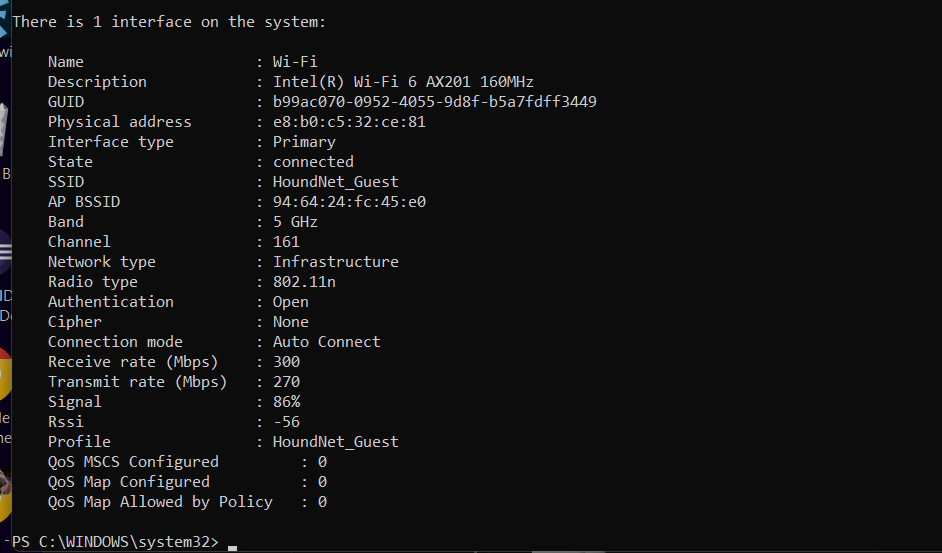
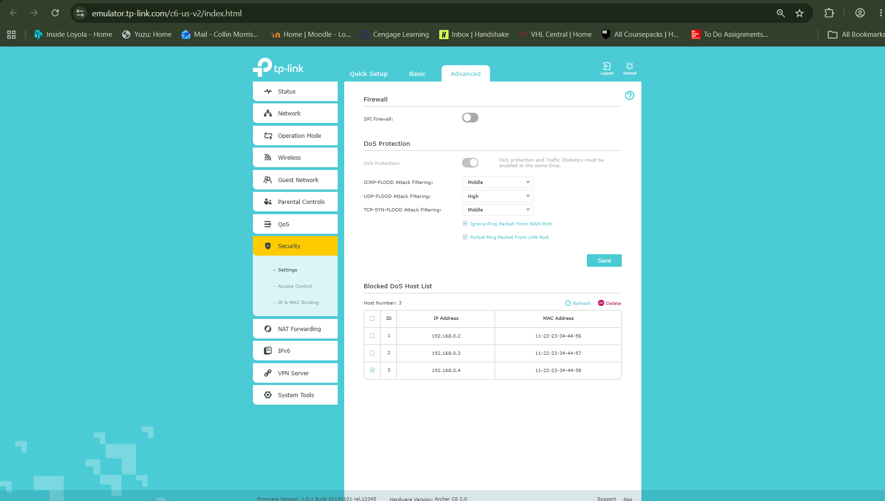
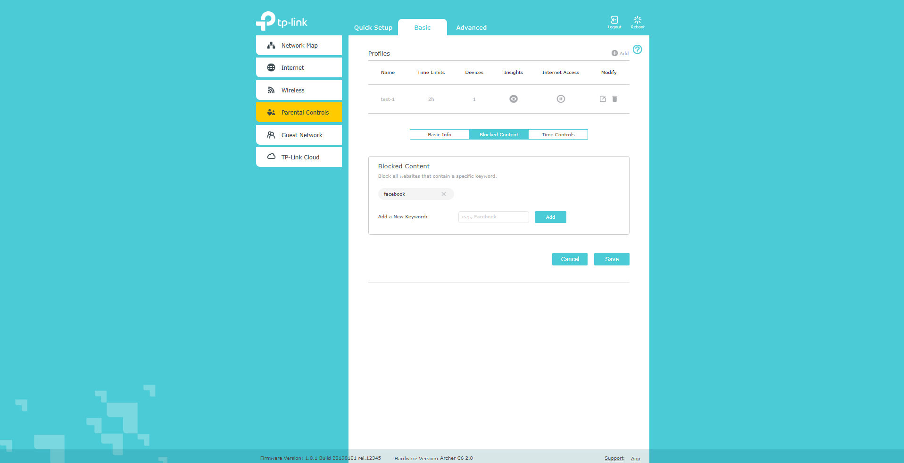

# Tutorial 6

## Task 1: View Wi-Fi Details

### Observed Access Point Information:
* **SSID:** `HoundNet_Guest`
* **BSSID:** `94:64:24:fc:45:e0`
* **Frequency Band:** `5 GHz`
* **Channel:** `161`
* **Radio Type:** `802.11n`
* **Signal Quality / RSSI:** `86%` / `-56 dBm`
* **Link Data Rates:**
  * **Receive Rate:** `300 Mbps`
  * **Transmit Rate:** `270 Mbps`
* **Authentication / Cipher:** `Open` / `None` (typical unencrypted guest portal configuration)

### Observations:
Connecting across the 5 GHz band on Channel 161 avoids the heavy co-channel interference commonly found in the crowded 2.4 GHz band. The `-56 dBm` RSSI provides a strong link signal, enabling symmetrical high-speed throughput (270–300 Mbps) despite using open authentication.

---

## Task 2: Wi-Fi Access Point Configuration & Design Settings

### Critical Settings to Consider in Wireless Network Design:

1. **Firewall & DoS Flood Filtering:**
   * **Observed State:** SPI Firewall enabled; ICMP, UDP, and TCP SYN flood filtering set to Middle/High levels.
   * **Design Recommendation:** Enable SPI Firewall and WAN ping blocking (`Ignore Ping Packet From WAN Port`).
   * **Rationale:** Hiding the WAN gateway IP from public ICMP sweeps limits external reconnaissance and stops basic volumetric flooding before it consumes router CPU cycles.

2. **Authentication, Encryption, and Guest Isolation:**
   * **Design Recommendation:** Deploy `WPA3-Personal` (or `WPA2/WPA3-Enterprise` in campus/enterprise settings) using AES encryption. If running a guest SSID like `HoundNet_Guest`, client isolation must be enabled.
   * **Rationale:** Open networks allow passive packet eavesdropping. WPA3 provides robust protection against offline dictionary attacks via Simultaneous Authentication of Equals (SAE), while client isolation prevents unauthorized peer-to-peer lateral movement across the subnet.

3. **Band Selection, Channel Assignment, and Channel Width:**
   * **Design Recommendation:** Separate SSIDs or use band steering to route high-throughput devices to **5 GHz** (or **6 GHz** on Wi-Fi 6E/7) with 40/80 MHz channels, while restricting **2.4 GHz** to non-overlapping channels (1, 6, or 11) at 20 MHz width.
   * **Rationale:** The 2.4 GHz spectrum has only three non-overlapping channels and is prone to interference from Bluetooth, microwaves, and neighboring APs. Confining 2.4 GHz to 20 MHz channels minimizes adjacent-channel bleed, while 5 GHz channels (such as Channel 161) provide higher capacity with significantly less interference.

4. **Access Control & Content Filtering:**
   * **Observed State:** Domain-level keyword blocking for platforms like Facebook, alongside profile scheduling.
   * **Design Recommendation:** Implement category-based DNS filtering and MAC address access controls where policy enforcement is needed.
   * **Rationale:** Prevents non-business or non-educational bandwidth saturation and shields endpoints from navigating to known malware and phishing domains.

---

## Task 3: Group Project Continuation

* **Project Progress:** Reviewed the semester network architecture requirements in preparation for the upcoming Project Draft milestone.
